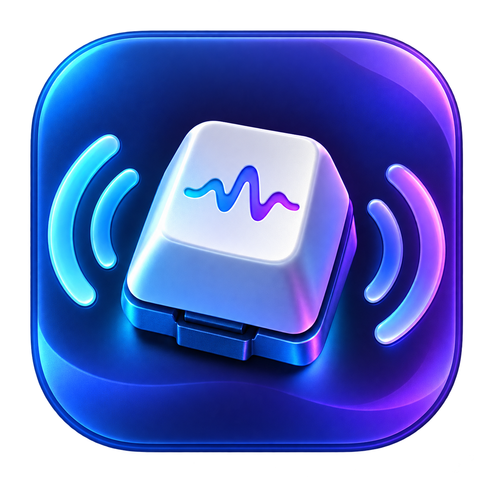

<p align="center">
  
</p>

# NeoKeys

[](https://github.com/arqueox/NeoKeys/releases)
[](https://github.com/arqueox/NeoKeys/releases/latest)
[](LICENSE)

Sons de teclado satisfatórios, exclusivamente para o **MacBook Neo**.

NeoKeys é uma pequena app nativa para a barra de menus do macOS. Reproduz gravações de teclados físicos enquanto escreve, sem enviar ou guardar o que é digitado.

> Compatibilidade oficial: MacBook Neo `Mac17,5`, macOS 14 ou posterior. MacBook Air, MacBook Pro, iMac, Mac mini e outros modelos não são suportados.

## Funcionalidades

- App discreta na barra de menus, sem ícone na Dock
- **Cherry Real:** 12 gravações de teclas físicas
- **Máquina de escrever real:** sons distintos para teclas normais, Espaço, Return e Backspace
- Perfis adicionais Butterfly, Thock, Clicky, Creamy, Typewriter e Soft
- Reprodução sobreposta para acompanhar escrita rápida
- Volume, ativação e perfil guardados entre sessões
- Opção para abrir ao iniciar sessão
- Funcionamento totalmente local, sem analytics nem ligação à Internet

## Instalar

1. Descarregue `NeoKeys.zip` na página [Releases](../../releases/latest).
2. Descompacte e mova `NeoKeys.app` para `/Applications`.
3. Abra a app. Por ser uma build comunitária sem notarização, poderá ser necessário clicar com o botão direito e escolher **Abrir** na primeira execução.
4. Autorize em **Definições do Sistema → Privacidade e Segurança → Monitorização de entrada**.
5. Feche e volte a abrir a app se o macOS o solicitar.

O menu deverá indicar **Deteção global ativa**. Use **Testar som** para confirmar a saída de áudio.

## Privacidade

NeoKeys usa um `CGEventTap` em modo exclusivamente de leitura para receber o código físico de cada tecla e escolher um som. Não reconstrói palavras, não guarda teclas, não utiliza rede e não recolhe dados. Consulte [PRIVACY.md](PRIVACY.md).

## Compilar

Requer as Command Line Tools do Xcode e Swift 6 ou posterior.

```sh
git clone https://github.com/arqueox/NeoKeys.git
cd NeoKeys
chmod +x build-app.sh
./build-app.sh
```

A aplicação será criada em `dist/NeoKeys.app`.

## Sons e licenças

O código do NeoKeys é disponibilizado sob a licença MIT. As gravações incluídas mantêm as respetivas licenças CC0 e MIT. Consulte [Resources/Sounds/ATTRIBUTION.md](Resources/Sounds/ATTRIBUTION.md) antes de redistribuir os assets.

## Estado do projeto

O projeto é comunitário e direcionado apenas ao MacBook Neo. Relatórios de bugs e melhorias são bem-vindos através das Issues.

As estatísticas públicas estão disponíveis no [painel do NeoKeys](https://arqueox.github.io/NeoKeys/).
